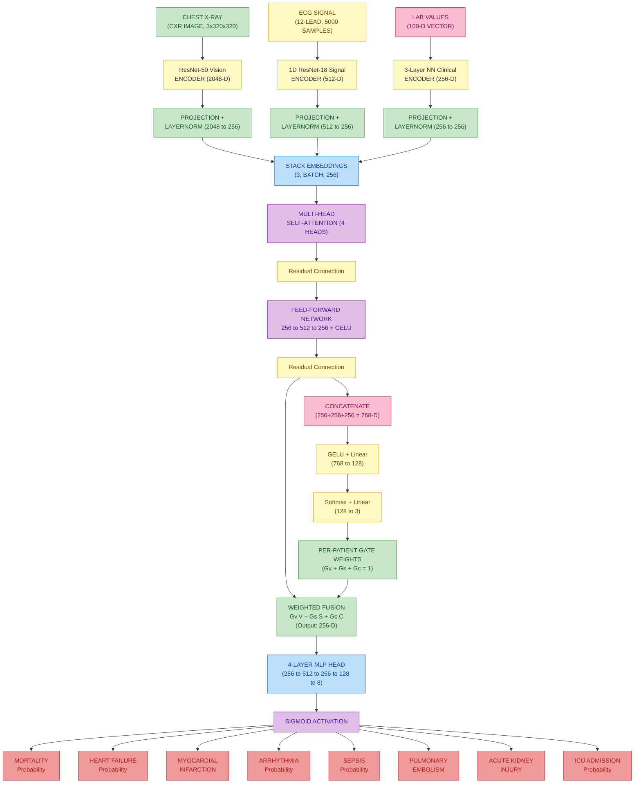
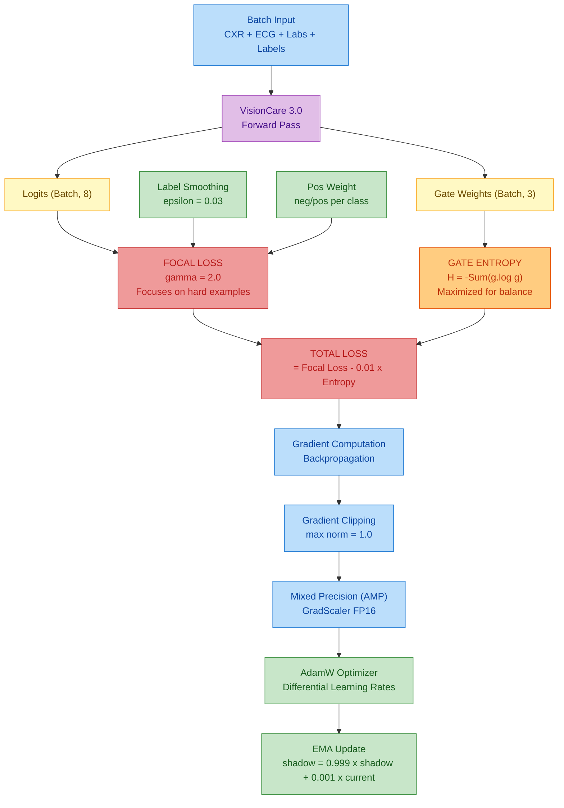
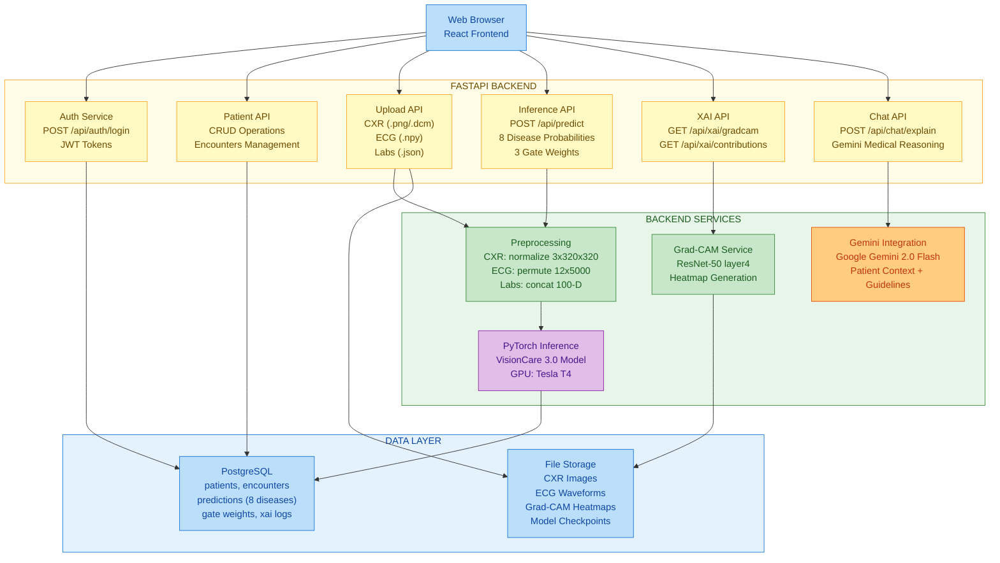
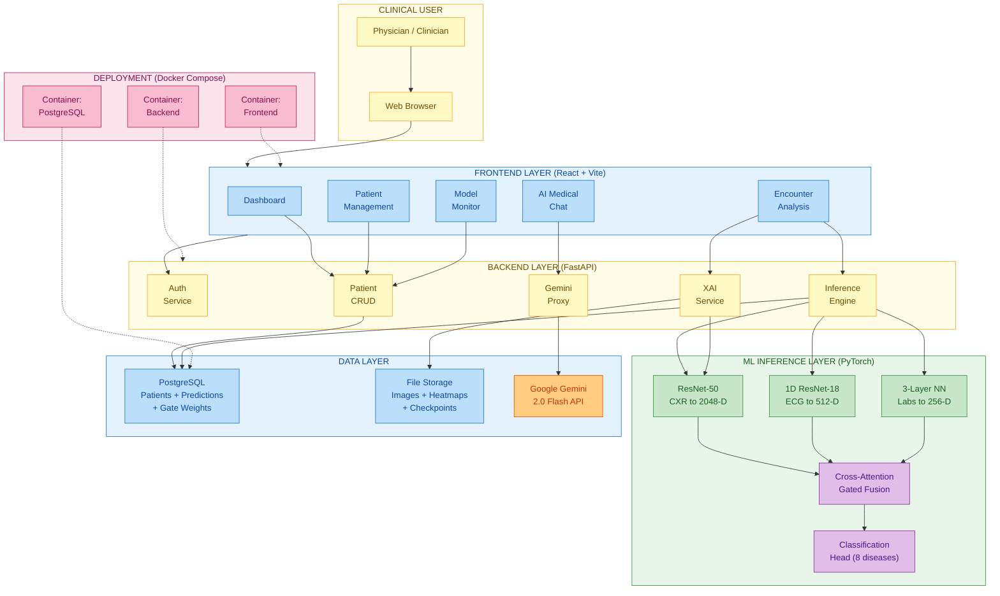

# VisionCare 3.0 — Architecture Diagrams (Mermaid)

Paste into [mermaid.live](https://mermaid.live) → Download as SVG/PNG for PPT.

---

## 1. VisionCare 3.0 — Fusion Model Architecture

---

## 2. Progressive Unfreezing Strategy (Phase A to Phase B)

```mermaid
graph LR
    subgraph PHASE_A["PHASE A: FROZEN ENCODERS (Epochs 1-5)"]
        direction TB
        A1["ResNet-50 (CXR)<br/>ALL LAYERS FROZEN"]
        A2["1D ResNet-18 (ECG)<br/>ALL LAYERS FROZEN"]
        A3["3-Layer NN (Labs)<br/>ALL LAYERS FROZEN"]
        A4["Cross-Attention + Head<br/>TRAINING (LR = 3e-4)"]
        A5["Trainable: 2.0M params (6.4%)"]
        A6["Gates: V=42% S=36% C=22%"]
    end

    UNFREEZE["UNFREEZE<br/>Layer3 + Layer4<br/>of each Encoder"]

    subgraph PHASE_B["PHASE B: PARTIAL FINE-TUNE (Epochs 6-25)"]
        direction TB
        B1["ResNet-50 (CXR)<br/>Layer1-2: Frozen<br/>Layer3-4: Fine-tune"]
        B2["1D ResNet-18 (ECG)<br/>Layer1-2: Frozen<br/>Layer3-4: Fine-tune"]
        B3["3-Layer NN (Labs)<br/>ALL LAYERS Fine-tune"]
        B4["Encoder LR = 1e-5<br/>Fusion LR = 2e-4"]
        B5["Trainable: 19.1M params (61%)"]
        B6["Gates: V=34% S=34% C=32%<br/>BALANCED"]
    end

    PHASE_A --> UNFREEZE --> PHASE_B

    style A1 fill:#bbdefb,stroke:#1976d2,color:#0d47a1
    style A2 fill:#bbdefb,stroke:#1976d2,color:#0d47a1
    style A3 fill:#bbdefb,stroke:#1976d2,color:#0d47a1
    style A4 fill:#c8e6c9,stroke:#388e3c,color:#1b5e20
    style A5 fill:#fff9c4,stroke:#f9a825,color:#6d4c00
    style A6 fill:#f8bbd0,stroke:#c2185b,color:#880e4f

    style UNFREEZE fill:#ffcc80,stroke:#e65100,color:#bf360c

    style B1 fill:#c8e6c9,stroke:#388e3c,color:#1b5e20
    style B2 fill:#c8e6c9,stroke:#388e3c,color:#1b5e20
    style B3 fill:#c8e6c9,stroke:#388e3c,color:#1b5e20
    style B4 fill:#fff9c4,stroke:#f9a825,color:#6d4c00
    style B5 fill:#fff9c4,stroke:#f9a825,color:#6d4c00
    style B6 fill:#c8e6c9,stroke:#388e3c,color:#1b5e20

    style PHASE_A fill:#e3f2fd,stroke:#1976d2,color:#0d47a1
    style PHASE_B fill:#e8f5e9,stroke:#388e3c,color:#1b5e20
```

---

## 3. Training Pipeline (Loss + Optimization)

---

## 4. Backend Architecture (FastAPI)

---

## 5. Frontend Architecture (React + Vite)

```mermaid
graph TD
    subgraph APP["REACT APP (Vite + React Router)"]
        ROUTER["App.jsx<br/>Root Router + Layout"]
    end

    subgraph PAGES["PAGES"]
        LOGIN["Login.jsx<br/>JWT Authentication"]
        DASH["Dashboard.jsx<br/>System Overview + Metrics"]
        PATIENTS["Patients.jsx<br/>Patient List + Search"]
        PROFILE["PatientProfile.jsx<br/>Demographics + History"]
        ENCOUNTER["EncounterAnalysis.jsx<br/>Main 3-Panel Analysis UI"]
        ANALYSIS["AnalysisCenter.jsx<br/>Multi-Disease Comparison"]
        MONITOR["ModelMonitor.jsx<br/>V3 Performance Tracking"]
    end

    subgraph COMPONENTS["REUSABLE COMPONENTS"]
        SIDEBAR["Sidebar.jsx<br/>Navigation Menu"]
        TOPBAR["TopBar.jsx<br/>Header + User Info"]
        CXRVIEW["CXRViewer.jsx<br/>X-Ray + Grad-CAM Overlay"]
        ECGVIEW["ECGViewer.jsx<br/>12-Lead Waveform Chart"]
        RISK["RiskGauge.jsx<br/>Circular Risk Dial x8"]
        AICHAT["AIChat.jsx<br/>Gemini Chat Window"]
    end

    subgraph UTILS["UTILITIES"]
        API_JS["api.js<br/>REST Client + Auth"]
        GEMINI_JS["gemini.js<br/>Gemini API Integration"]
        MOCK["mockData.js<br/>Demo Data for Dev"]
    end

    subgraph STYLES["STYLING"]
        CSS1["index.css<br/>Design Tokens + Variables"]
        CSS2["App.css<br/>Dark Theme + Animations"]
    end

    ROUTER --> LOGIN
    ROUTER --> DASH
    ROUTER --> PATIENTS
    ROUTER --> PROFILE
    ROUTER --> ENCOUNTER
    ROUTER --> ANALYSIS
    ROUTER --> MONITOR

    ENCOUNTER --> CXRVIEW
    ENCOUNTER --> ECGVIEW
    ENCOUNTER --> RISK
    ENCOUNTER --> AICHAT

    DASH --> SIDEBAR
    DASH --> TOPBAR

    AICHAT --> GEMINI_JS
    ENCOUNTER --> API_JS

    ROUTER --> CSS1
    ROUTER --> CSS2

    style ROUTER fill:#e1bee7,stroke:#8e24aa,color:#4a148c

    style LOGIN fill:#fff9c4,stroke:#f9a825,color:#6d4c00
    style DASH fill:#fff9c4,stroke:#f9a825,color:#6d4c00
    style PATIENTS fill:#fff9c4,stroke:#f9a825,color:#6d4c00
    style PROFILE fill:#fff9c4,stroke:#f9a825,color:#6d4c00
    style ENCOUNTER fill:#c8e6c9,stroke:#388e3c,color:#1b5e20
    style ANALYSIS fill:#fff9c4,stroke:#f9a825,color:#6d4c00
    style MONITOR fill:#fff9c4,stroke:#f9a825,color:#6d4c00

    style SIDEBAR fill:#bbdefb,stroke:#1976d2,color:#0d47a1
    style TOPBAR fill:#bbdefb,stroke:#1976d2,color:#0d47a1
    style CXRVIEW fill:#bbdefb,stroke:#1976d2,color:#0d47a1
    style ECGVIEW fill:#bbdefb,stroke:#1976d2,color:#0d47a1
    style RISK fill:#bbdefb,stroke:#1976d2,color:#0d47a1
    style AICHAT fill:#bbdefb,stroke:#1976d2,color:#0d47a1

    style API_JS fill:#c8e6c9,stroke:#388e3c,color:#1b5e20
    style GEMINI_JS fill:#c8e6c9,stroke:#388e3c,color:#1b5e20
    style MOCK fill:#c8e6c9,stroke:#388e3c,color:#1b5e20

    style CSS1 fill:#f8bbd0,stroke:#c2185b,color:#880e4f
    style CSS2 fill:#f8bbd0,stroke:#c2185b,color:#880e4f

    style APP fill:#f3e5f5,stroke:#8e24aa,color:#4a148c
    style PAGES fill:#fffde7,stroke:#f9a825,color:#6d4c00
    style COMPONENTS fill:#e3f2fd,stroke:#1976d2,color:#0d47a1
    style UTILS fill:#e8f5e9,stroke:#388e3c,color:#1b5e20
    style STYLES fill:#fce4ec,stroke:#c2185b,color:#880e4f
```

---

## 6. Overall System Architecture (End-to-End)

---

## 7. Data Flow: Upload to Prediction

```mermaid
graph LR
    subgraph UPLOAD["STEP 1: UPLOAD"]
        U1["CXR Image<br/>(.png / .dcm)"]
        U2["ECG Recording<br/>(.npy / .csv)"]
        U3["Lab Results<br/>(.json / .csv)"]
    end

    subgraph PREPROCESS["STEP 2: PREPROCESS"]
        P1["Normalize<br/>3 x 320 x 320"]
        P2["Permute<br/>12 x 5000"]
        P3["Concat<br/>Percentiles + Missingness<br/>100-D"]
    end

    subgraph ENCODE["STEP 3: ENCODE"]
        E1["ResNet-50<br/>2048-D"]
        E2["1D ResNet-18<br/>512-D"]
        E3["3-Layer NN<br/>256-D"]
    end

    subgraph FUSE["STEP 4: FUSE"]
        F1["Project to 256-D"]
        F2["Cross-Attention<br/>4 Heads"]
        F3["Gating Network<br/>3 Weights"]
        F4["Weighted Blend"]
    end

    subgraph CLASSIFY["STEP 5: CLASSIFY"]
        C1["MLP Head<br/>256 to 512 to 256<br/>to 128 to 8"]
        C2["Sigmoid<br/>8 Probabilities"]
    end

    subgraph OUTPUT["STEP 6: OUTPUT"]
        O1["8 Disease Risks"]
        O2["Gate Weights<br/>V=34% S=34% C=32%"]
        O3["Grad-CAM Heatmap"]
        O4["Gemini AI Explanation"]
    end

    U1 --> P1 --> E1 --> F1
    U2 --> P2 --> E2 --> F1
    U3 --> P3 --> E3 --> F1
    F1 --> F2
    F2 --> F3
    F2 --> F4
    F3 --> F4
    F4 --> C1 --> C2
    C2 --> O1
    F3 --> O2
    E1 --> O3
    O1 --> O4
    O2 --> O4

    style U1 fill:#c8e6c9,stroke:#388e3c,color:#1b5e20
    style U2 fill:#fff9c4,stroke:#f9a825,color:#6d4c00
    style U3 fill:#f8bbd0,stroke:#c2185b,color:#880e4f

    style P1 fill:#c8e6c9,stroke:#66bb6a,color:#1b5e20
    style P2 fill:#fff9c4,stroke:#f9a825,color:#6d4c00
    style P3 fill:#f8bbd0,stroke:#e91e63,color:#880e4f

    style E1 fill:#c8e6c9,stroke:#66bb6a,color:#1b5e20
    style E2 fill:#fff9c4,stroke:#f9a825,color:#6d4c00
    style E3 fill:#f8bbd0,stroke:#e91e63,color:#880e4f

    style F1 fill:#bbdefb,stroke:#1976d2,color:#0d47a1
    style F2 fill:#e1bee7,stroke:#8e24aa,color:#4a148c
    style F3 fill:#ffcc80,stroke:#e65100,color:#bf360c
    style F4 fill:#bbdefb,stroke:#1976d2,color:#0d47a1

    style C1 fill:#e1bee7,stroke:#8e24aa,color:#4a148c
    style C2 fill:#e1bee7,stroke:#8e24aa,color:#4a148c

    style O1 fill:#ef9a9a,stroke:#c62828,color:#b71c1c
    style O2 fill:#c8e6c9,stroke:#388e3c,color:#1b5e20
    style O3 fill:#bbdefb,stroke:#1976d2,color:#0d47a1
    style O4 fill:#ffcc80,stroke:#e65100,color:#bf360c

    style UPLOAD fill:#e8f5e9,stroke:#388e3c,color:#1b5e20
    style PREPROCESS fill:#fffde7,stroke:#f9a825,color:#6d4c00
    style ENCODE fill:#e8f5e9,stroke:#388e3c,color:#1b5e20
    style FUSE fill:#e3f2fd,stroke:#1976d2,color:#0d47a1
    style CLASSIFY fill:#f3e5f5,stroke:#8e24aa,color:#4a148c
    style OUTPUT fill:#fce4ec,stroke:#c2185b,color:#880e4f
```

---

## 8. Version Evolution (V1 to V2 to V3)

```mermaid
graph LR
    subgraph V1["V1: CONCAT FUSION<br/>AUC = 0.7702"]
        V1A["ConvNeXt + 1D-CNN + MLP"]
        V1B["Simple Concatenation<br/>768+256+64 = 1088-D"]
        V1C["MLP Head, 6 classes"]
        V1D["No Gate Weights<br/>No Explainability"]
    end

    subgraph V2["V2: CROSS-ATTENTION<br/>AUC = 0.8105"]
        V2A["ConvNeXt + 1D-CNN + MLP<br/>All Frozen"]
        V2B["Cross-Attention Gating<br/>4-Head Attention"]
        V2C["MLP Head, 2 classes<br/>HF + Mortality"]
        V2D["Gate Weights: Explainable<br/>V=34% S=31% C=35%"]
    end

    subgraph V3["V3: PROGRESSIVE UNFREEZE<br/>AUC = 0.7926"]
        V3A["ResNet-50 + ResNet-18 + 3-NN<br/>Progressive Unfreeze"]
        V3B["Cross-Attention + FFN<br/>+ Gate Entropy Reg"]
        V3C["MLP Head, 8 classes<br/>All 8 Diseases"]
        V3D["Balanced Gates<br/>V=34% S=34% C=32%"]
        V3E["Focal Loss + EMA<br/>+ Data Augmentation"]
    end

    V1 -->|"+5.2% AUC<br/>Added Attention"| V2
    V2 -->|"8 Diseases<br/>Balanced Gates<br/>+16.6% vs Single"| V3

    style V1A fill:#bbdefb,stroke:#1976d2,color:#0d47a1
    style V1B fill:#bbdefb,stroke:#1976d2,color:#0d47a1
    style V1C fill:#bbdefb,stroke:#1976d2,color:#0d47a1
    style V1D fill:#ef9a9a,stroke:#c62828,color:#b71c1c

    style V2A fill:#fff9c4,stroke:#f9a825,color:#6d4c00
    style V2B fill:#fff9c4,stroke:#f9a825,color:#6d4c00
    style V2C fill:#fff9c4,stroke:#f9a825,color:#6d4c00
    style V2D fill:#c8e6c9,stroke:#388e3c,color:#1b5e20

    style V3A fill:#c8e6c9,stroke:#388e3c,color:#1b5e20
    style V3B fill:#c8e6c9,stroke:#388e3c,color:#1b5e20
    style V3C fill:#c8e6c9,stroke:#388e3c,color:#1b5e20
    style V3D fill:#c8e6c9,stroke:#388e3c,color:#1b5e20
    style V3E fill:#c8e6c9,stroke:#388e3c,color:#1b5e20

    style V1 fill:#e3f2fd,stroke:#1976d2,color:#0d47a1
    style V2 fill:#fffde7,stroke:#f9a825,color:#6d4c00
    style V3 fill:#e8f5e9,stroke:#388e3c,color:#1b5e20
```

---

## Color Legend

| Color | Hex | Used For |
|-------|-----|----------|
| Light Green | `#c8e6c9` | Inputs, projections, active/trainable components |
| Light Yellow | `#fff9c4` | Encoders, intermediate steps, API endpoints |
| Light Pink | `#f8bbd0` | Clinical/Labs pathway, styling |
| Light Blue | `#bbdefb` | Attention, data layer, components |
| Light Purple | `#e1bee7` | Fusion, classification, model core |
| Light Orange | `#ffcc80` | Unfreeze trigger, Gemini, entropy |
| Salmon Red | `#ef9a9a` | Disease output probabilities, warnings |

## How to Use

1. Go to [mermaid.live](https://mermaid.live)
2. Paste any code block above
3. Download as **SVG** (best for PPT, stays sharp)
4. Insert into PowerPoint
